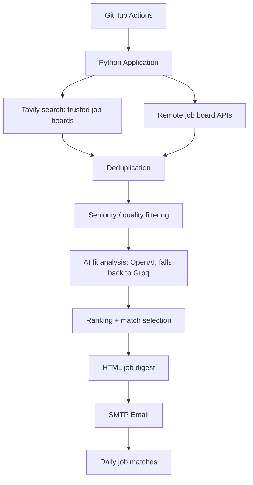

# JobRadar AI

A personal AI job-search agent. Every day it searches trusted job boards and
remote job APIs, scores every posting against one specific candidate's resume,
and emails back only the roles genuinely worth applying to — with the reason,
the skill gaps, and a direct apply link for each one.

## Why this project exists

Job hunting as a fresher means checking the same handful of sites every day,
reading dozens of listings, and re-deriving "is this actually worth my time?"
for each one. JobRadar AI automates that judgment call: it searches on your
behalf, filters out roles you're clearly not eligible for (wrong seniority,
missing core requirements), and ranks what's left against your actual skills —
so the only thing left to do each morning is open the email and apply.

## How this differs from TechRadar AI

This project reuses the same architectural pattern and provider stack as
[TechRadar AI](../TechRedar) (layered Python, OpenAI-compatible structured
output, YAML-driven personalization, GitHub Actions scheduling) but is a
**separate, independent project** solving a different problem — job matching
against one candidate's resume instead of technology news curation. Nothing
here imports from or depends on the TechRadar AI codebase.

## Features

| Feature | Description |
|---|---|
| Trusted-site web search | Searches LinkedIn, Naukri, Indeed, Internshala, Instahyre, Cutshort, Wellfound, Foundit, Hirist, and Glassdoor via the Tavily search API |
| Remote job board APIs | RemoteOK, Arbeitnow, We Work Remotely, Himalayas, and Jobicy — free, no signup required |
| Deterministic deduplication | Removes exact and near-duplicate postings before any AI cost is incurred |
| Seniority pre-filter | Drops postings that are obviously senior/lead/staff/principal before spending an AI call on them |
| AI fit scoring | Scores each posting 0–100 against the candidate's actual skills, target roles, and seniority level |
| Automatic LLM fallback | Tries OpenAI first; if its quota/credits are exhausted mid-run, automatically switches to Groq for the rest of that run |
| Skill gap analysis | Lists matched skills and missing skills for every scored posting |
| Daily email digest | Inline-CSS HTML email with a "top matches" spotlight, direct apply links, and sources checked |
| Config-driven personalization | The candidate's skills, target roles, and location/work-mode preferences live in YAML, not code |
| Scheduled automation | Runs daily via GitHub Actions, with manual trigger support |

## Architecture



## Job sources — and why these

Major boards like LinkedIn, Naukri, and Indeed don't offer a public API, and
scraping their pages directly would violate their Terms of Service and get
blocked by bot detection almost immediately. Two legitimate approaches remain:

1. **Search, don't scrape.** [Tavily](https://tavily.com) is a search API built
   for this — it does its own fetching and returns clean results; this project
   never bypasses a login wall, CAPTCHA, or bot-detection system on any site.
   Searches are restricted to an allowlist of well-known, reputable job
   platforms (see `config/job_sources.yaml` → `search.trusted_domains`), so
   results don't come from spam job-aggregator clones.
2. **Use a real public API.** RemoteOK, Arbeitnow, We Work Remotely, Himalayas,
   and Jobicy all publish official, documented, free APIs for their own
   listings — no signup, no ToS violation, no scraping involved.

## Tech Stack

Python 3.12+, the OpenAI Python SDK (used for both OpenAI and Groq, since Groq
exposes an OpenAI-compatible endpoint), Pydantic v2, httpx, feedparser,
python-dotenv, PyYAML, BeautifulSoup, `smtplib`, pytest.

## Project Structure

```text
JobRadarAI/
├── app/
│   ├── main.py               # orchestrates the daily pipeline
│   ├── config/settings.py    # env vars + YAML config loading
│   ├── domain/                # models & enums (JobPosting, AnalyzedJob, ...)
│   ├── collectors/             # Tavily search + remote job board APIs
│   ├── services/                # dedup, filtering, ranking, briefing assembly
│   ├── ai/                       # LLM client (OpenAI + Groq fallback), prompts, schemas, analyzer
│   ├── email/                     # HTML digest template + SMTP sender
│   └── utils/                     # logging, text normalization
├── config/
│   ├── candidate_profile.yaml     # the candidate's skills, roles, location (edit this!)
│   └── job_sources.yaml           # search queries, trusted domains, remote board APIs
├── tests/
└── .github/workflows/daily_job_search.yml
```

## Configuration

Copy `.env.example` to `.env` and fill in your own values (never commit `.env`):

```text
OPENAI_API_KEY=        # tried first
OPENAI_MODEL=gpt-4o-mini
GROQ_API_KEY=           # automatic fallback once OpenAI's quota/credits run out
GROQ_MODEL=openai/gpt-oss-120b

TAVILY_API_KEY=         # sign up free at https://app.tavily.com

EMAIL_HOST=smtp.gmail.com
EMAIL_PORT=587
EMAIL_USERNAME=
EMAIL_PASSWORD=         # an app password, not your normal login password
EMAIL_FROM=
EMAIL_TO=

MAX_JOBS_PER_SOURCE=40  # cap per source after filtering
MAX_AI_JOBS=40          # cap on how many postings go to the LLM
MIN_MATCH_SCORE=90      # only postings at/above this score count as a "strong match"
TOP_MATCHES_COUNT=5
```

Edit `config/candidate_profile.yaml` to change whose job search this is —
target roles, skills, experience level, location, and work-mode preference.
Edit `config/job_sources.yaml` to change which sites are searched, the search
queries used, or the remote job board APIs polled.

## GitHub Secrets

| Secret | Purpose |
|---|---|
| `OPENAI_API_KEY` / `OPENAI_MODEL` | Primary LLM provider |
| `GROQ_API_KEY` / `GROQ_MODEL` | Automatic fallback provider |
| `TAVILY_API_KEY` | Trusted-site job search |
| `EMAIL_HOST` / `EMAIL_PORT` | SMTP server address and port |
| `EMAIL_USERNAME` / `EMAIL_PASSWORD` | SMTP authentication |
| `EMAIL_FROM` / `EMAIL_TO` | Sender and recipient address |

## Local Development

```bash
python -m venv .venv
source .venv/Scripts/activate   # Windows Git Bash; use .venv/bin/activate on macOS/Linux
pip install -r requirements.txt
cp .env.example .env            # then fill in your values
python -m pytest -q
python -m app.main
```

## GitHub Actions

The workflow at `.github/workflows/daily_job_search.yml` runs automatically
every day at **02:30 UTC (08:00 IST)** and can also be triggered manually from
the **Actions** tab via `workflow_dispatch`.

## The OpenAI → Groq fallback

`app/ai/llm_client.py` wraps two providers behind one interface. Every AI call
tries OpenAI first; if OpenAI returns a quota/credits-exhausted error, the
client logs a warning, switches to Groq, and stays on Groq for the rest of
that run (it doesn't retry a dead OpenAI key on every subsequent job). Both
providers use the same structured-output contract, so nothing else in the
pipeline needs to know which one actually answered.

## Match scoring

Every posting gets:

```text
match_score       0-100, overall fit (skills + seniority + role/location fit)
seniority_fit      true only if a fresher could realistically apply
matched_skills     candidate skills the posting explicitly wants
missing_skills     requirements the candidate doesn't have
concerns           anything that should give the candidate pause
```

A posting that requires several years of experience scores low even with a
perfect tech-stack match — seniority mismatch is treated as disqualifying, not
a minor deduction. Only postings scoring at or above `MIN_MATCH_SCORE` count
as a "strong match"; if nothing clears that bar on a given day, the digest
shows the closest matches anyway and says so clearly, rather than sending an
empty email.

## Security

- All credentials are read from environment variables, never hardcoded
- `.env` is gitignored and has never been committed
- `.env.example` documents every required variable with empty values
- No secret is ever logged

## Avoiding duplicate jobs across days

`app/services/seen_store.py` keeps a small SQLite file (`data/seen_jobs.db`) recording
every job URL that's already been analyzed. Each run filters those out *before* the AI
stage — so a posting that's still showing up in a source's feed a second day doesn't
get re-analyzed (saving an AI call) or re-emailed. Only jobs whose analysis actually
succeeded are recorded; one that failed to analyze (e.g. both LLM providers down) is
retried on the next run. Entries older than `SEEN_JOBS_RETENTION_DAYS` (default 60) are
pruned automatically so the file doesn't grow forever.

**Important if you run this on GitHub Actions:** a runner is a fresh, disposable VM —
nothing written during a run survives to the next one unless it's saved somewhere
durable. This project handles that by having the workflow commit the updated
`data/seen_jobs.db` back to the repo after each run (see the "Persist seen-jobs store"
step in `.github/workflows/daily_job_search.yml`), using the workflow's own
`GITHUB_TOKEN` — no extra secret, no external database, no added cost. Locally, the
file just persists on disk between runs like any other file.

## Future Roadmap

- Resume-fit feedback loop (mark a posting as applied / not interested)
- Cover-letter drafting for the top matches
- Multi-candidate support (one config profile per person)
